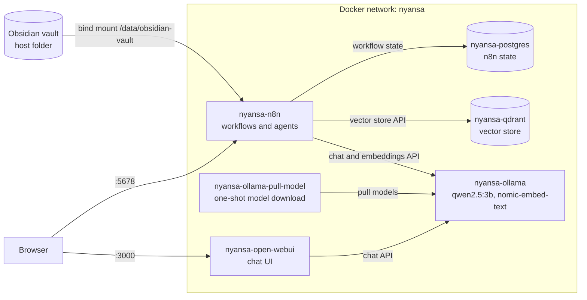

# Nyansa

[](LICENSE)
[](docker-compose.yml)

Nyansa is a self-hosted AI "second brain" built to run on a private server. It
is a Docker Compose stack of local LLMs, a vector store and a workflow engine,
wired to an Obsidian vault. Notes, models and data stay on infrastructure you
control. The name comes from the Akan word *nyansa*, "wisdom".

<!-- DEMO: remplacer par docs/demo.gif (enregistrement de Nyansa répondant à une question à partir du vault Obsidian) -->

## Features

- **One-command stack.** Seven services on a dedicated `nyansa` Docker network,
  with named volumes for every stateful component.
- **Local inference with Ollama.** On first start, the stack pulls `qwen2.5:3b`
  (chat) and `nomic-embed-text` (embeddings). Both are sized for CPU-only
  machines with limited RAM.
- **Workflow orchestration with n8n.** State is persisted in PostgreSQL.
  Credentials and workflows in `n8n/demo-data/` are imported on first boot and
  skipped if workflows already exist.
- **Obsidian vault access.** The vault folder set in `OBSIDIAN_VAULT_PATH` is
  mounted read/write into n8n at `/data/obsidian-vault`.
- **Vector store.** Qdrant runs in the stack, and an n8n credential for it is
  provisioned on first boot.
- **Chat interface.** Open WebUI is connected to Ollama and served on port 3000.
- **Secrets out of the code.** Database credentials, n8n encryption keys and the
  vault path are read from `.env`.

## Architecture



The Ollama container is named `nyansa-ollama` regardless of the profile used
to start it. n8n and Open WebUI both reach it at `nyansa-ollama:11434`.

## Tech stack

| Component | Image | Role |
|---|---|---|
| n8n | `n8nio/n8n:latest` | Workflow engine and AI agent orchestration |
| Ollama | `ollama/ollama:latest` (`ollama/ollama:rocm` for AMD) | Local LLM and embedding inference |
| Qdrant | `qdrant/qdrant` | Vector store |
| PostgreSQL | `postgres:16-alpine` | n8n persistence |
| Open WebUI | `ghcr.io/open-webui/open-webui:main` | Browser chat interface for Ollama |
| `qwen2.5:3b` | Ollama model | Chat model |
| `nomic-embed-text` | Ollama model | Embedding model |

## Deployment

The stack targets a single Docker host, such as a private server.

- Long-running services (`nyansa-n8n`, `nyansa-postgres`, `nyansa-qdrant`,
  `nyansa-open-webui`, Ollama) use `restart: unless-stopped`.
- All state lives in named volumes. Docker prefixes them with the Compose
  project name. Back these up together with `.env`:

  | Volume | Content |
  |---|---|
  | `nyansa_postgres_storage` | n8n workflows, credentials and executions |
  | `nyansa_n8n_storage` | n8n local files and binary data |
  | `nyansa_qdrant_storage` | Qdrant collections |
  | `nyansa_ollama_storage` | Downloaded models |
  | `nyansa_openwebui_storage` | Open WebUI users and chat history |

- Keep `N8N_ENCRYPTION_KEY` with the backups. n8n cannot decrypt stored
  credentials without it.
- The Compose file publishes ports 5678, 3000, 6333 and 11434 on all host
  interfaces. It does not include a reverse proxy, TLS or authentication for
  Qdrant and Ollama. On an internet-facing host, restrict these ports with a
  firewall and expose the UIs through a reverse proxy or VPN.

<!-- TODO: décrire ici le reverse proxy, HTTPS et l'accès distant (avec your-domain.com comme placeholder) une fois leur configuration ajoutée au dépôt. -->

## Getting started (local)

### Prerequisites

- Docker with Docker Compose v2.24 or later (the Compose file uses the
  `env_file` `path`/`required` syntax).
- An existing folder for your Obsidian vault.

### Setup

```bash
git clone https://github.com/Geobatpo07/nyansa.git
cd nyansa
cp .env.example .env
```

Edit `.env` and set at least:

| Variable | Purpose |
|---|---|
| `POSTGRES_PASSWORD` | PostgreSQL password |
| `N8N_ENCRYPTION_KEY` | Key n8n uses to encrypt stored credentials |
| `N8N_USER_MANAGEMENT_JWT_SECRET` | Secret for n8n session tokens |
| `OBSIDIAN_VAULT_PATH` | Absolute path to your vault on the host |

To generate a key in PowerShell: `[System.Guid]::NewGuid().ToString()`.

### Run

```bash
docker compose --profile cpu up -d
```

The first start downloads both models. To follow progress:

```bash
docker logs -f nyansa-ollama-pull-model
```

### Access

| Service | URL |
|---|---|
| n8n editor | <http://localhost:5678> |
| Open WebUI | <http://localhost:3000> |
| Qdrant dashboard | <http://localhost:6333/dashboard> |
| Ollama API | <http://localhost:11434> |

### GPU profiles

`docker-compose.yml` also defines `gpu-nvidia` and `gpu-amd` profiles. They do
not start yet: `nyansa-open-webui` depends on `nyansa-ollama-cpu`, which is only
enabled by the `cpu` profile. Use `--profile cpu` for now.

## Project structure

```text
.
├── docker-compose.yml        # Services, volumes, network and cpu / gpu-nvidia / gpu-amd profiles
├── .env.example              # Template for secrets and the vault path
├── n8n/
│   └── demo-data/
│       ├── credentials/      # n8n credentials (Ollama, Qdrant), imported on first boot
│       └── workflows/        # n8n workflows, imported on first boot
├── shared/                   # Host folder mounted at /data/shared in n8n (created on first run)
├── docs/                     # README assets (demo recording)
└── LICENSE                   # Apache License 2.0
```

## Roadmap

- Sync the Obsidian vault with Syncthing. The vault is a local folder for now
  (see the comment in `.env.example`).

## Credits

Nyansa started as a fork of the
[n8n self-hosted AI starter kit](https://github.com/n8n-io/self-hosted-ai-starter-kit),
released under the Apache License 2.0. The base Compose layout, the first-boot
import logic and the files in `n8n/demo-data/` come from that project.

Changes made in Nyansa:

- Renamed services, volumes and network under the `nyansa` namespace.
- Added the Open WebUI service.
- Mounted the Obsidian vault into n8n.
- Replaced `llama3.2` with `qwen2.5:3b` and added the `nomic-embed-text`
  embedding model.
- Replaced the default secrets in `.env.example`.

This project is distributed under the Apache License 2.0. See [LICENSE](LICENSE).
