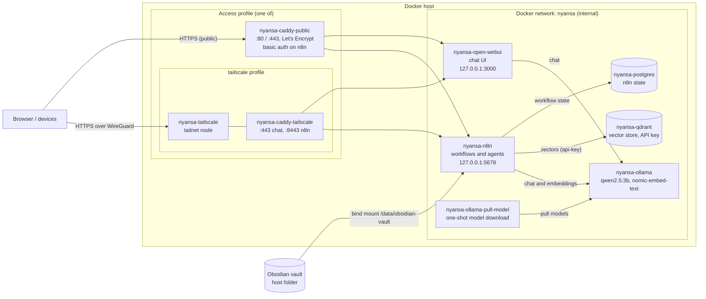

# Nyansa

[](LICENSE)
[](docker-compose.yml)

Nyansa is a self-hosted AI "second brain" built to run on a private server. It
is a Docker Compose stack of local LLMs, a vector store and a workflow engine,
wired to an Obsidian vault. Notes, models and data stay on infrastructure you
control. The name comes from the Akan word *nyansa*, "wisdom".

<!-- DEMO: remplacer par docs/demo.gif (enregistrement de Nyansa répondant à une question à partir du vault Obsidian) -->

## Features

- **One-command stack.** Services on a dedicated `nyansa` Docker network, with
  named volumes for every stateful component and a fixed Compose project name.
- **Local inference with Ollama.** On first start, the stack pulls `qwen2.5:3b`
  (chat) and `nomic-embed-text` (embeddings). Both are sized for CPU-only
  machines with limited RAM. `cpu`, `gpu-nvidia` and `gpu-amd` profiles.
- **Workflow orchestration with n8n.** State is persisted in PostgreSQL.
  Credentials and workflows in `n8n/demo-data/` are imported on first boot and
  skipped if workflows already exist.
- **Obsidian vault access.** The vault folder set in `OBSIDIAN_VAULT_PATH` is
  mounted read/write into n8n at `/data/obsidian-vault`.
- **Vector store.** Qdrant, protected by an API key that n8n receives at
  runtime.
- **Chat interface.** Open WebUI connected to Ollama.
- **Secure access, two modes.** Caddy serves Open WebUI and the n8n editor
  over HTTPS, either on a public domain (Let's Encrypt, basic auth in front of
  n8n) or on a Tailscale tailnet with no public port at all.
- **Push-to-deploy with rollback.** `git push prod main` builds an immutable
  release folder, backs up, deploys, waits for health and switches only on
  success. The previous release is restarted otherwise.
- **Backups.** Scripts to back up and restore the PostgreSQL database and every
  stateful volume, with checksums and retention.
- **Verifiable security rules.** `scripts/check-exposure.sh` checks the port
  exposure of all 9 profile combinations, and `scripts/check-secrets.sh`
  refuses tracked secrets. Both run before every push.

## Architecture



Only Caddy is reachable from outside. PostgreSQL, Qdrant and Ollama publish no
port. n8n and Open WebUI listen on `127.0.0.1` for SSH tunnels only. The Ollama
container is named `nyansa-ollama` whatever the hardware profile.

## Tech stack

| Component | Image (pinned default) | Role |
|---|---|---|
| n8n | `n8nio/n8n:2.40.7` | Workflow engine and AI agent orchestration |
| Ollama | `ollama/ollama:0.34.4` (`-rocm` for AMD) | Local LLM and embedding inference |
| Qdrant | `qdrant/qdrant:v1.19.1` | Vector store |
| PostgreSQL | `postgres:16.15-alpine` | n8n persistence |
| Open WebUI | `ghcr.io/open-webui/open-webui:v0.7.2` | Browser chat interface for Ollama |
| Caddy | `caddy:2.11.4-alpine` | Reverse proxy, automatic HTTPS |
| Tailscale | `tailscale/tailscale:v1.102.5` | Private access (tailscale profile) |
| `qwen2.5:3b` | Ollama model | Chat model |
| `nomic-embed-text` | Ollama model | Embedding model |

Each version can be overridden from `.env` (`N8N_VERSION`, `OLLAMA_VERSION`, ...).

## Security

Threat model: a single-owner server reachable from the internet. The goals
are that no internal service is reachable from outside, that every entry point
needs authentication over HTTPS, and that no secret lives in the repository.

| Measure | Where |
|---|---|
| PostgreSQL, Qdrant and Ollama publish no port; they are only reachable on the internal `nyansa` network. | `docker-compose.yml` |
| n8n and Open WebUI are bound to `127.0.0.1`; outside access goes through Caddy. | `docker-compose.yml` |
| Docker bypasses UFW for published ports, so exposure is enforced in Compose and checked for all 9 profile combinations. | `scripts/check-exposure.sh` |
| HTTPS everywhere: Let's Encrypt (public) or tailnet certificates (tailscale). HSTS, `nosniff`, `frame-ancestors 'self'`, no `Server` header. | `caddy/` |
| n8n editor: HTTP basic auth (public profile) on top of the n8n login. Webhook paths are exempt and use per-workflow auth. | `caddy/Caddyfile.public` |
| Tailscale profile: no port published on the host at all. | `docker-compose.yml` |
| Open WebUI: public sign-up disabled; the admin account is created from `.env` only when no user exists, so nobody can register first. | `docker-compose.yml` |
| Qdrant requires an API key. n8n receives it through `CREDENTIALS_OVERWRITE_DATA`, never stored in Git. | `docker-compose.yml` |
| n8n gets an explicit list of variables, not the whole `.env`; workflows cannot read environment variables; cookies are secure. | `docker-compose.yml` |
| Compose refuses to start when a critical secret is missing. | `docker-compose.yml` |
| Images are pinned to verified versions. | `docker-compose.yml` |
| No secret in Git: `.env` is ignored, `.env.example` has placeholders only, and the pre-push hook scans for secret files and tokens. | `scripts/check-secrets.sh`, `hooks/pre-push` |
| Deployments run as a dedicated non-root user, from release folders that contain no `.env` and no development files. | `hooks/post-receive`, `scripts/build-publish.sh` |
| Backups before every deployment, restore script with checksum verification. | `scripts/backup.sh`, `scripts/restore.sh` |

Known limits: members of the `docker` group are root-equivalent on the host.
Backups are not encrypted: copy them to an encrypted destination. Ollama has no
authentication of its own and relies on network isolation.

## Deployment

Production runs from immutable release folders, never from a working tree:

1. `git push prod main` from your machine. The `pre-push` hook first scans the
   commit for secrets and builds a release from it with all checks.
2. On the server, `hooks/post-receive` builds `/opt/nyansa/releases/<sha>/`
   from the pushed commit, links the production `.env`, validates the Compose
   configuration, takes a backup, pulls images and starts the stack.
3. Once every container is healthy, `/opt/nyansa/current` points to the new
   release and old releases are pruned (5 kept by default). On failure,
   `current` is unchanged and the previous release is started again.

[docs/DEPLOY.md](docs/DEPLOY.md) is the full from-scratch guide: server
preparation, secret generation, public or Tailscale access, firewall, first
deployment, admin accounts, final checks, backups, restore, rollback and
secret rotation.

## Getting started (local)

### Prerequisites

- Docker with Docker Compose v2.24 or later.
- An existing folder for your Obsidian vault.

### Setup

```bash
git clone https://github.com/Geobatpo07/nyansa.git
cd nyansa
cp .env.example .env
scripts/install-hooks.sh   # optional: enables the pre-push checks
```

Edit `.env` and set at least:

| Variable | Purpose |
|---|---|
| `POSTGRES_PASSWORD` | PostgreSQL password |
| `N8N_ENCRYPTION_KEY` | Key n8n uses to encrypt stored credentials |
| `N8N_USER_MANAGEMENT_JWT_SECRET` | Secret for n8n session tokens |
| `WEBUI_SECRET_KEY` | Secret for Open WebUI sessions |
| `QDRANT_API_KEY` | Qdrant API key |
| `WEBUI_ADMIN_EMAIL`, `WEBUI_ADMIN_PASSWORD` | First Open WebUI admin account |
| `OBSIDIAN_VAULT_PATH` | Absolute path to your vault on the host |

Generate each secret with `openssl rand -hex 32`, or in PowerShell with
`[System.Guid]::NewGuid().ToString("N")`.

### Run

Locally, no access profile is needed:

```bash
docker compose --profile cpu up -d
docker logs -f nyansa-ollama-pull-model   # first start: model download
```

### Access

| Service | URL |
|---|---|
| Open WebUI | <http://localhost:3000> (log in with `WEBUI_ADMIN_EMAIL`) |
| n8n editor | <http://localhost:5678> |

Qdrant and Ollama are internal only. To open the Qdrant dashboard temporarily:

```bash
docker run --rm --network nyansa -p 127.0.0.1:6333:6333 alpine/socat:1.8.1.3 \
  TCP-LISTEN:6333,fork,reuseaddr TCP:nyansa-qdrant:6333
# then http://localhost:6333/dashboard, with QDRANT_API_KEY
```

### Checks

```bash
scripts/check-exposure.sh --env-file .env.example   # port exposure, 9 profile combinations
scripts/check-secrets.sh HEAD                       # tracked secrets
scripts/build-publish.sh HEAD                       # build and validate ./publish
```

## Project structure

```text
.
├── docker-compose.yml        # Services, volumes, network; hardware and access profiles
├── .env.example              # Template for secrets, URLs, profiles and paths
├── caddy/                    # Caddyfiles for the public and tailscale profiles
├── n8n/
│   └── demo-data/
│       ├── credentials/      # n8n credentials (Ollama, Qdrant), no secret, imported on first boot
│       └── workflows/        # n8n workflows, imported on first boot
├── scripts/
│   ├── backup.sh / restore.sh        # Backups of the database and volumes
│   ├── check-exposure.sh             # Port exposure rules for every profile combination
│   ├── check-secrets.sh              # Refuses tracked secrets
│   ├── build-publish.sh              # Builds a release folder from a commit
│   ├── wait-healthy.sh               # Waits for a healthy stack
│   └── install-hooks.sh              # Installs the Git hooks
├── hooks/
│   ├── pre-push              # Dev machine: secrets scan and release build
│   └── post-receive          # Server: push-to-deploy with rollback
├── docs/
│   └── DEPLOY.md             # From-scratch deployment and operations guide
└── LICENSE                   # Apache License 2.0
```

`publish/`, `backups/` and `shared/` are generated locally and ignored by Git.

## Roadmap

- RAG ingestion service for the Obsidian vault (`services/memory-api`), with
  source citations in chat.
- Graph memory built from wikilinks, backlinks and tags.
- Sync the Obsidian vault across devices with Syncthing.
- CI: lint, typecheck, tests and Compose validation.

## Credits

Nyansa started as a fork of the
[n8n self-hosted AI starter kit](https://github.com/n8n-io/self-hosted-ai-starter-kit),
released under the Apache License 2.0. The base Compose layout, the first-boot
import logic and the demo workflow in `n8n/demo-data/` come from that project.

Changes made in Nyansa:

- Renamed services, volumes and network under the `nyansa` namespace.
- Added the Open WebUI service.
- Mounted the Obsidian vault into n8n.
- Replaced `llama3.2` with `qwen2.5:3b` and added the `nomic-embed-text`
  embedding model.
- Replaced the default secrets in `.env.example`.
- Replaced the encrypted demo credentials with plaintext, secret-free ones.
- Added the security hardening, reverse proxy, backups and push-to-deploy
  pipeline described above.

This project is distributed under the Apache License 2.0. See [LICENSE](LICENSE).
