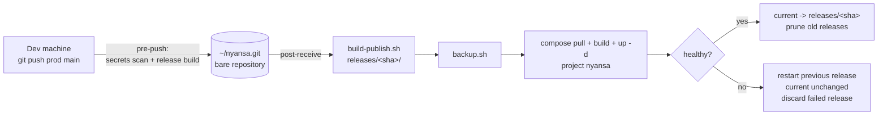

# Deploying Nyansa

This guide installs Nyansa from scratch on a new Linux server and sets up
push-to-deploy. Every command is meant to be run by you. Placeholders:

| Placeholder | Meaning |
|---|---|
| `server` | SSH address of your server (IP or host name) |
| `chat.example.com`, `n8n.example.com` | your domains (public profile) |
| `your-tailnet.ts.net` | your tailnet DNS name (tailscale profile) |

## How deployment works

Production never runs from a Git working tree. A push to the `main` branch of
a bare repository on the server triggers `hooks/post-receive`, which builds a
release folder from that exact commit and switches to it only once the stack
is healthy.



A container that restarts 3 times without becoming ready is treated as a
crash loop: the hook rolls back at once instead of waiting for
`NYANSA_HEALTH_TIMEOUT`. A release that fails (build error, crash, timeout)
is deleted with its image once the previous release runs again, so the kept
releases are always working ones. Its deployment log keeps the details.

Server layout:

```text
/opt/nyansa/
├── releases/<sha>/     one folder per deployed commit (runtime files only)
│   └── .env -> /opt/nyansa/shared/.env
├── current -> releases/<sha>
├── shared/
│   ├── .env            production environment (never in Git or a release)
│   ├── files/          n8n shared folder (NYANSA_FILES_PATH)
│   └── vault/          Obsidian vault (OBSIDIAN_VAULT_PATH)
├── backups/            one folder per backup
└── logs/               one log per deployment
```

The Compose project name is always `nyansa` (set in `docker-compose.yml` and
passed with `-p nyansa`), and volumes have fixed names, so every release
drives the same containers and data.

## 1. Prerequisites

Server:

- A Linux server (Debian 12 or Ubuntu 24.04 tested paths), 8 GB RAM or more
  for `qwen2.5:3b` on CPU, 30 GB free disk.
- Docker Engine with the Compose plugin v2.24 or later
  ([install guide](https://docs.docker.com/engine/install/)).
- `git`, `jq`, `flock` (util-linux) and `sha256sum` (coreutils):

  ```bash
  sudo apt-get update && sudo apt-get install -y git jq util-linux coreutils openssl
  ```

- Public profile: a domain whose DNS you control.
- Tailscale profile: a Tailscale account (tailnet).

Development machine: Git, Bash (Git Bash on Windows), the Docker CLI (the
daemon is not needed for the checks) and `jq`.

## 2. Before reinstalling: export and remove the old instance

Skip this section on a brand new server.

On the server, in the folder of the old stack:

```bash
# What exists today
docker ps -a --filter name=nyansa --format 'table {{.Names}}\t{{.Image}}\t{{.Status}}'
docker volume ls --filter name=nyansa

# Export every n8n workflow as JSON (one file per workflow)
docker exec nyansa-n8n n8n export:workflow --all --separate --output=/home/node/.n8n/export
docker cp nyansa-n8n:/home/node/.n8n/export ./n8n-export-old
ls ./n8n-export-old
```

Copy `n8n-export-old/` to your machine (`scp -r server:<path>/n8n-export-old .`)
and keep it out of the repository. Credentials are not exported: recreate them
in the new instance. Open WebUI chats can be exported from the UI
(Settings > Chats > Export) if you want to keep them.

Optional safety copy of every old volume before deleting it:

```bash
mkdir -p ~/nyansa-old-volumes
for v in $(docker volume ls -q --filter name=nyansa); do
  docker run --rm -v "$v:/v:ro" -v ~/nyansa-old-volumes:/b alpine:3.24.2 tar czf "/b/$v.tar.gz" -C /v .
done
```

Stop and delete the old containers, network and volumes (irreversible):

```bash
cd <old-stack-folder>
docker compose --profile cpu down --volumes --remove-orphans
# Volumes left behind by other profiles or project names
docker volume ls -q --filter name=nyansa | xargs -r docker volume rm
docker network ls -q --filter name=nyansa | xargs -r docker network rm
```

Then remove any firewall rule that opened 3000, 5678, 6333 or 11434, and
delete the old clone folder once you no longer need it.

## 3. Prepare the server

Create a dedicated non-root user in the `docker` group. Membership of
`docker` is equivalent to root on the host, so this account must only accept
SSH keys.

```bash
sudo adduser --disabled-password --gecos "" nyansa
sudo usermod -aG docker nyansa
sudo install -d -m 700 -o nyansa -g nyansa /home/nyansa/.ssh
# Paste your public key (from your dev machine: cat ~/.ssh/id_ed25519.pub),
# then press Ctrl-D
sudo -u nyansa tee -a /home/nyansa/.ssh/authorized_keys
sudo chmod 600 /home/nyansa/.ssh/authorized_keys
```

Create the deployment tree and the bare repository:

```bash
sudo install -d -m 750 -o nyansa -g nyansa /opt/nyansa
sudo -u nyansa mkdir -p /opt/nyansa/{releases,shared,backups,logs}
# n8n runs as UID 1000 and writes to these folders
sudo install -d -o 1000 -g 1000 /opt/nyansa/shared/files /opt/nyansa/shared/vault

sudo -u nyansa git init --bare /home/nyansa/nyansa.git
sudo -u nyansa git -C /home/nyansa/nyansa.git symbolic-ref HEAD refs/heads/main
```

## 4. Create the production `.env`

From your dev machine, copy the template to the server:

```bash
scp .env.example nyansa@server:/opt/nyansa/shared/.env
```

On the server, as `nyansa`, generate the secrets in place:

```bash
sudo -iu nyansa
cd /opt/nyansa/shared
chmod 600 .env

for key in POSTGRES_PASSWORD N8N_ENCRYPTION_KEY N8N_USER_MANAGEMENT_JWT_SECRET \
           WEBUI_SECRET_KEY QDRANT_API_KEY MEMORY_API_TOKEN WEBUI_ADMIN_PASSWORD; do
  sed -i "s|^$key=.*|$key=$(openssl rand -hex 32)|" .env
done

sed -i 's|^NYANSA_FILES_PATH=.*|NYANSA_FILES_PATH=/opt/nyansa/shared/files|' .env
sed -i 's|^OBSIDIAN_VAULT_PATH=.*|OBSIDIAN_VAULT_PATH=/opt/nyansa/shared/vault|' .env
```

Hex secrets are used on purpose: they never contain `$`, quotes or `/`,
which would break the `.env` or the JSON built from `QDRANT_API_KEY`.

Then edit `.env` (`nano .env`) and set `WEBUI_ADMIN_EMAIL`, plus the variables
of your access profile (section 5).

| Variable | How to generate |
|---|---|
| `POSTGRES_PASSWORD` | `openssl rand -hex 32` |
| `N8N_ENCRYPTION_KEY` | `openssl rand -hex 32` |
| `N8N_USER_MANAGEMENT_JWT_SECRET` | `openssl rand -hex 32` |
| `WEBUI_SECRET_KEY` | `openssl rand -hex 32` |
| `QDRANT_API_KEY` | `openssl rand -hex 32` |
| `MEMORY_API_TOKEN` | `openssl rand -hex 32` |
| `WEBUI_ADMIN_PASSWORD` | `openssl rand -hex 32`, or your own password |
| `N8N_BASIC_AUTH_HASH` (public) | `docker run --rm -it caddy:2.11.4-alpine caddy hash-password` (prompts for the password, so it stays out of shell history) |
| `TS_AUTHKEY` (tailscale) | Tailscale admin console > Settings > Keys > Generate auth key |

Store a copy of the finished `.env` in your password manager.
`N8N_ENCRYPTION_KEY` in particular cannot be recovered: without it, n8n
cannot decrypt the credentials of a restored backup.

## 5. Choose the access mode

Set `NYANSA_PROFILES` to one hardware profile (`cpu`, `gpu-nvidia` or
`gpu-amd`) and one access profile.

### Option A: public domain (`public`)

1. Create two DNS records pointing to the server's public IP (A, plus AAAA
   for IPv6):
   `chat.example.com` and `n8n.example.com`. Check with
   `dig +short chat.example.com`.
2. In `.env`:

   ```bash
   NYANSA_PROFILES="cpu public"
   ACME_EMAIL=you@example.com
   WEBUI_DOMAIN=chat.example.com
   N8N_DOMAIN=n8n.example.com
   WEBUI_PUBLIC_URL=https://chat.example.com
   N8N_PUBLIC_URL=https://n8n.example.com
   N8N_BASIC_AUTH_USER=nyansa
   # Single quotes are required: the hash contains "$"
   N8N_BASIC_AUTH_HASH='<output of caddy hash-password>'
   ```

Caddy obtains the Let's Encrypt certificates on first start. Ports 80 and 443
must be reachable from the internet for that.

### Option B: Tailscale only (`tailscale`)

1. In the [Tailscale admin console](https://login.tailscale.com/admin/dns),
   enable **MagicDNS** and **HTTPS Certificates**, and note your tailnet DNS
   name (`your-tailnet.ts.net`).
2. Generate an auth key (Settings > Keys). A one-off, non-ephemeral key is
   enough: the node identity is then kept in the `nyansa_tailscale_state`
   volume.
3. In `.env`:

   ```bash
   NYANSA_PROFILES="cpu tailscale"
   TS_AUTHKEY=tskey-auth-...
   TS_HOSTNAME=nyansa
   TS_TAILNET=your-tailnet.ts.net
   WEBUI_PUBLIC_URL=https://nyansa.your-tailnet.ts.net
   N8N_PUBLIC_URL=https://nyansa.your-tailnet.ts.net:8443
   ```

4. After the first deployment, open the machine `nyansa` in the admin console
   and disable key expiry for it.

Install Tailscale on each device that should reach Nyansa. If the server
itself already runs Tailscale for SSH, it is a different node: keep a
different name for `TS_HOSTNAME`.

## 6. Firewall

Docker writes its own iptables rules: a port published by a container is
reachable even when UFW denies it. That is why no service except the public
Caddy publishes a port outside `127.0.0.1`, and why
`scripts/check-exposure.sh` enforces it. UFW still protects everything else on
the host.

Public profile:

```bash
sudo ufw default deny incoming
sudo ufw default allow outgoing
sudo ufw allow OpenSSH
sudo ufw allow 80/tcp
sudo ufw allow 443/tcp
sudo ufw allow 443/udp   # HTTP/3
sudo ufw enable
```

Tailscale profile: only SSH is needed (`sudo ufw allow OpenSSH`, then
`sudo ufw enable`). If the host runs Tailscale, you can restrict SSH to it with
`sudo ufw allow in on tailscale0 to any port 22` and remove the OpenSSH rule.

Also check the firewall of your hosting provider, if any.

## 7. Set up your dev machine

```bash
# Enable the pre-push guard (secrets scan + release build before every push)
scripts/install-hooks.sh

# Add the production remote and install the deploy hook on the server
git remote add prod nyansa@server:nyansa.git
scripts/install-hooks.sh --remote nyansa@server
```

Run `scripts/install-hooks.sh --remote nyansa@server` again whenever
`hooks/post-receive` changes. Every other script is taken from the pushed
commit.

## 8. First deployment

```bash
git push prod main
```

The output of the deploy hook appears in your terminal, prefixed with
`remote:`. A push can succeed while the deployment fails: `post-receive` runs
after Git has updated the branch. Always read the last line (`deployment of
<sha> succeeded` or `DEPLOY FAILED: ...`).

The first run pulls every image. Ollama then downloads the models in the
background (about 2.5 GB):

```bash
ssh nyansa@server docker logs -f nyansa-ollama-pull-model
```

Deployment logs are kept on the server:

```bash
ssh nyansa@server 'ls -t /opt/nyansa/logs | head -n 5'
```

To deploy the same commit again (for example after editing `.env`), run the
hook by hand:

```bash
ssh nyansa@server 'cd ~/nyansa.git && echo "0 $(git rev-parse main) refs/heads/main" | hooks/post-receive'
```

## 9. Create the admin accounts

**Open WebUI.** The admin account is created on first start from
`WEBUI_ADMIN_EMAIL` and `WEBUI_ADMIN_PASSWORD`, only when no user exists yet.
Public sign-up is disabled, so nobody else can register. Log in, change the
password in the UI, then clear `WEBUI_ADMIN_PASSWORD=` in `.env`. It is not
used once a user exists. Sign-up is stored in the Open WebUI database after
the first start: to invite other people later, use Admin Panel > Settings
instead of `.env`.

**n8n.** Open the editor URL right after the first deployment and create the
owner account. With the public profile, the browser first asks for the basic
auth user and password.

## 10. Final checks

On the server:

```bash
cd /opt/nyansa/current
cat RELEASE
docker ps --filter label=com.docker.compose.project=nyansa --format 'table {{.Names}}\t{{.Status}}'
scripts/check-exposure.sh                        # exposure rules with the real .env
sudo ss -tlnp | grep -E ':(80|443|3000|5678|6333|8080|11434)\b'
```

`ss` must show 3000 and 5678 on `127.0.0.1` only, 80/443 on all interfaces
with the public profile, and nothing on 6333, 8080 or 11434.

Qdrant rejects requests without the key:

```bash
docker exec nyansa-open-webui curl -s -o /dev/null -w '%{http_code}\n' http://nyansa-qdrant:6333/collections
# 401
```

From another machine (outside the tailnet):

```bash
nmap -Pn -p 22,80,443,3000,5678,6333,8443,11434 server
# public: only 22, 80 and 443 open. tailscale: only 22 open.
```

Public profile:

```bash
curl -sI https://chat.example.com | grep -i strict-transport   # HSTS present
curl -s -o /dev/null -w '%{http_code}\n' https://n8n.example.com/            # 401
curl -s -o /dev/null -w '%{http_code}\n' https://n8n.example.com/webhook/x   # 404 from n8n, not 401
```

In n8n, open the credential **Local QdrantApi database** and click **Test**.
It must succeed without typing any key.

memory-api is internal only. Check it and run the first ingestion of the
vault from a container on the same network:

```bash
TOKEN=$(grep '^MEMORY_API_TOKEN=' /opt/nyansa/shared/.env | cut -d= -f2)
docker exec nyansa-open-webui curl -s http://nyansa-memory-api:8080/health
# {"status":"ok","checks":{"ollama":"ok","qdrant":"ok"},"ingesting":false}
docker exec nyansa-open-webui curl -s -X POST http://nyansa-memory-api:8080/ingest \
  -H "authorization: Bearer $TOKEN"
docker exec nyansa-open-webui curl -s -X POST http://nyansa-memory-api:8080/search \
  -H "authorization: Bearer $TOKEN" -H 'content-type: application/json' \
  -d '{"query": "a question about your notes", "limit": 3}'
```

The first ingestion needs `nomic-embed-text` to be downloaded
(`docker logs nyansa-ollama-pull-model`). On a CPU-only server it embeds
about 2 chunks per second: count roughly 15 to 20 minutes per 500 notes.
The HTTP call stays open until the end; if it is cut, the ingestion still
finishes in the background (`/health` shows `"ingesting": true`). Later
incremental runs only process the changed notes. From phase 3, an n8n
workflow runs it on a schedule.

Finally, take a first manual backup (next section).

## 11. Operations

### Backups

A backup runs automatically before every deployment. To also run one every
night, add a cron entry for `nyansa` (`crontab -e`):

```cron
30 3 * * * cd /opt/nyansa/current && BACKUP_DIR=/opt/nyansa/backups ./scripts/backup.sh >> /opt/nyansa/logs/backup.log 2>&1
```

Each backup contains a PostgreSQL dump, archives of the n8n, Qdrant,
Open WebUI, Caddy and Tailscale volumes, a manifest and checksums. The
services writing to those volumes are stopped for a few seconds during the
copy. Downloaded models are left out (the Ollama volume and Open WebUI's
`cache/`, about 1 GB): they are fetched again after a restore, which needs
internet access. Backups are kept 14 days (`BACKUP_RETENTION_DAYS`). They are not
encrypted and include chat history: copy them off the server to an encrypted
destination (for example `restic`), together with a copy of `.env`.

### Restore

The stack must exist (at least one deployment). Use the same `.env`, or at
least the same `N8N_ENCRYPTION_KEY`, as when the backup was taken.

```bash
cd /opt/nyansa/current
./scripts/restore.sh /opt/nyansa/backups/<timestamp> --yes
```

### Rollback

Preferred: revert the faulty commit and push. The history stays correct and
the next push does not bring the problem back.

```bash
git revert <sha> && git push prod main
```

Manual rollback, on the server, to one of the kept releases:

```bash
cd /opt/nyansa
ls -lt releases/                      # pick a previous <sha>
cat releases/<sha>/RELEASE
ln -sfn /opt/nyansa/releases/<sha> current.new && mv -Tf current.new current
cd current
docker compose -p nyansa --profile cpu --profile public up -d --remove-orphans   # your NYANSA_PROFILES
./scripts/wait-healthy.sh 300
```

A newer n8n may have migrated its database. If the older version refuses to
start, restore the backup taken before the faulty deployment (its timestamp
is in the deployment log).

The next `git push prod main` deploys the pushed commit again.

### Switching access profile

Stop the Caddy of the old profile, then change `NYANSA_PROFILES` and deploy
again:

```bash
docker rm -f nyansa-caddy-public         # or nyansa-caddy-tailscale nyansa-tailscale
```

Update the firewall rules to match (section 6).

### Upgrading images

Image versions are pinned in `docker-compose.yml`. Change them in a commit
and push. The deploy hook takes a backup, pulls the new images and rolls back
if the stack does not become healthy.

### Rotating secrets

| Secret | Procedure |
|---|---|
| `QDRANT_API_KEY` | Edit `.env` and redeploy. Qdrant, n8n and memory-api pick up the new key. |
| `MEMORY_API_TOKEN` | Edit `.env` and redeploy; update the clients that call memory-api. |
| `N8N_BASIC_AUTH_HASH` | Edit `.env` and redeploy. |
| `WEBUI_SECRET_KEY` | Edit `.env` and redeploy. Every user is logged out. |
| `POSTGRES_PASSWORD` | Change it in PostgreSQL first (`ALTER USER`), then in `.env`, then redeploy. |
| `N8N_ENCRYPTION_KEY` | Cannot be changed in place: export the workflows, recreate the credentials in a new instance. |
| `TS_AUTHKEY` | Only used for the first login. Revoke it in the admin console once the node is registered. |

## Troubleshooting

| Symptom | Check |
|---|---|
| `DEPLOY FAILED: ... is missing` | `/opt/nyansa/shared/.env` exists and belongs to `nyansa`. |
| `required variable ... is missing a value` | That variable is empty in `.env`. |
| Timeout waiting for health | `docker ps -a --filter label=com.docker.compose.project=nyansa`, then `docker logs <container>`. |
| Caddy cannot obtain a certificate (public) | DNS records, ports 80/443 open, `docker logs nyansa-caddy-public`. |
| No certificate on the tailnet | MagicDNS and HTTPS enabled; `docker logs nyansa-tailscale`, `docker logs nyansa-caddy-tailscale`. |
| `cannot reach the Docker daemon` | `id nyansa` lists the `docker` group; log out and back in after `usermod`. |
