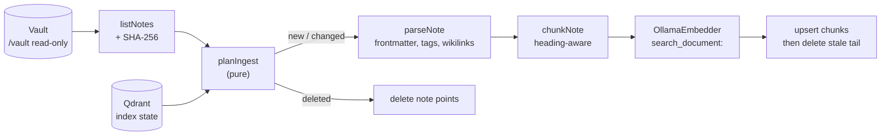

# memory-api

TypeScript service that turns the Obsidian vault into a searchable memory:
it parses the notes, splits them along their headings, embeds the chunks with
`nomic-embed-text` (Ollama) and stores them in Qdrant with their metadata.
`/search` returns the most relevant chunks with the note they come from, so
answers can cite their sources.

Node.js 24, Fastify 5, Zod 4, strict TypeScript, Vitest.

## API

Every route except `/health` requires `Authorization: Bearer <MEMORY_API_TOKEN>`.
The service is only reachable on the internal Docker network, at
`http://nyansa-memory-api:8080`.

### `GET /health`

`200` when Ollama and Qdrant answer (Qdrant with the API key), `503` otherwise.

```json
{ "status": "ok", "checks": { "ollama": "ok", "qdrant": "ok" }, "ingesting": false }
```

### `POST /ingest`

Body (optional): `{ "mode": "incremental" | "full" }`, default `incremental`.

- `incremental`: only notes whose content hash or index version changed are
  reindexed.
- `full`: every note is reindexed.
- In both modes, notes deleted from the vault are removed from the index.

One ingestion runs at a time; a concurrent call gets `409`.

```json
{
  "mode": "incremental",
  "startedAt": "2026-09-26T15:07:10.000Z",
  "durationMs": 2290,
  "notes": { "scanned": 4, "indexed": 4, "unchanged": 0, "deleted": 0, "failed": 0, "skipped": 0 },
  "chunks": { "upserted": 6 },
  "errors": []
}
```

A note that fails (for example an embedding error) is listed in `errors`. Its
previous version stays in the index, and the next run retries it.

When 3 notes in a row fail on Ollama or Qdrant (service down, model
missing), the run stops instead of failing every remaining note: the report
gets an `aborted` message and `notes.skipped` counts the notes not attempted.
They are retried by the next run.

The first full ingestion is bounded by the embedding speed. On a CPU-only
host, expect about 2 chunks per second (a 500-note vault of 2,250 chunks took
17 minutes in testing). Later incremental runs only embed the changed notes
(8 changed notes: 11 seconds).

### `POST /search`

```json
{ "query": "Comment je déploie Nyansa ?", "limit": 5, "tags": ["projet"], "minScore": 0.5 }
```

`limit` 1 to 50 (default 5). `tags` and `minScore` are optional.

```json
{
  "query": "Comment je déploie Nyansa ?",
  "results": [
    {
      "score": 0.662,
      "path": "projets/Nyansa.md",
      "title": "Nyansa",
      "section": "Nyansa > Déploiement",
      "tags": ["ia", "projet"],
      "chunkIndex": 2,
      "text": "Un `git push prod main` construit une release, ..."
    }
  ]
}
```

Errors: `400` invalid body, `401` missing or wrong token, `502` Ollama or
Qdrant failure.

## How it works



- **Parsing** (`src/markdown/parse.ts`): YAML frontmatter; title from
  `title:`, the first H1, or the file name; tags from the frontmatter and
  inline `#tags`, lower-cased; `[[target#heading|alias]]` and `![[embeds]]`.
  Fenced code and inline code are ignored. Invalid YAML is reported, not
  fatal.
- **Chunking** (`src/markdown/chunk.ts`): one section per ATX heading, with
  its heading path (`Setup > Docker`). Paragraphs are packed up to
  `CHUNK_MAX_CHARS` (1500); a code block is never split unless it exceeds the
  limit alone; oversized blocks are split by lines, sentences, then
  characters. A note without text is indexed by its title.
- **Embedding**: each chunk is embedded with its note title and section as a
  header, with the `search_document:` / `search_query:` prefixes that
  `nomic-embed-text` expects.
- **Storage**: one Qdrant point per chunk. The point id is a UUID derived from
  `path + chunk index`, so reindexing a note overwrites its points; chunks
  beyond the new count are deleted afterwards. The note is never missing from
  the index during an update. Payload: `path`, `title`, `tags`, `links`,
  `section`, `chunk_index`, `chunk_count`, `text`, `note_hash`,
  `index_version`, `indexed_at`. `path`, `tags` and `chunk_index` are indexed.
- **Incremental state** lives in Qdrant itself (first chunk of each note), so
  there is no second database to keep in sync. `index_version` changes with
  the embedding model or chunk size, which reindexes everything.
- **Architecture**: the ingestion and search logic depend on two interfaces
  (`Embedder`, `VectorStore` in `src/ports.ts`). `OllamaEmbedder` and
  `QdrantStore` implement them; tests use in-memory fakes.

## Configuration

| Variable | Default | |
|---|---|---|
| `MEMORY_API_TOKEN` | (required, 32+ chars) | Bearer token |
| `QDRANT_API_KEY` | (required) | Qdrant API key |
| `QDRANT_URL` | `http://nyansa-qdrant:6333` | |
| `QDRANT_COLLECTION` | `obsidian_notes` | |
| `OLLAMA_URL` | `http://nyansa-ollama:11434` | |
| `EMBEDDING_MODEL` | `nomic-embed-text` | Changing it reindexes all notes |
| `CHUNK_MAX_CHARS` | `1500` | 200 to 8000; changing it reindexes all notes |
| `VAULT_PATH` | `/vault` | Mounted read-only |
| `MEMORY_API_PORT` | `8080` | |
| `LOG_LEVEL` | `info` | pino levels |

The vector size is read from the model at the first ingestion. A collection
created with another size is refused with an explicit error.

## Development

```bash
cd services/memory-api
npm ci
npm test            # Vitest: parsing, chunking, incremental logic, adapters, API
npm run typecheck
npm run build       # dist/
```

Tests never call Ollama or Qdrant: the adapters are tested against a stubbed
`fetch`, and the ingestion and API tests use in-memory fakes with a temporary
vault on disk.

Calling the running service from the Docker network (with `MEMORY_API_TOKEN`
from `.env`):

```bash
docker exec nyansa-open-webui curl -s -X POST http://nyansa-memory-api:8080/ingest \
  -H "authorization: Bearer $MEMORY_API_TOKEN"
docker exec nyansa-open-webui curl -s -X POST http://nyansa-memory-api:8080/search \
  -H "authorization: Bearer $MEMORY_API_TOKEN" -H 'content-type: application/json' \
  -d '{"query": "What did I write about Docker?"}'
```

## Known limits

- Only Markdown files are indexed (no PDF or image content). Notes are read as
  UTF-8; a file that is not valid UTF-8 is decoded as Windows-1252 and logged.
- Setext headings (`Title` underlined with `===`) are not treated as
  headings.
- `nomic-embed-text` is trained mostly on English. French notes are found,
  with less precise ranking; a multilingual model can be set with
  `EMBEDDING_MODEL`.
